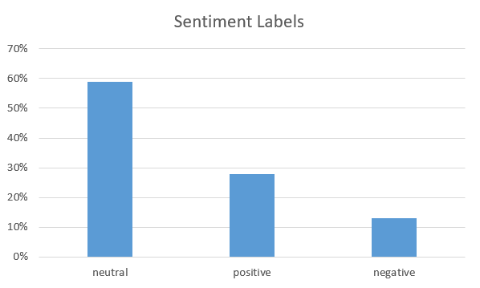
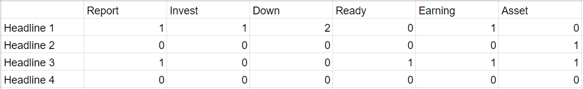
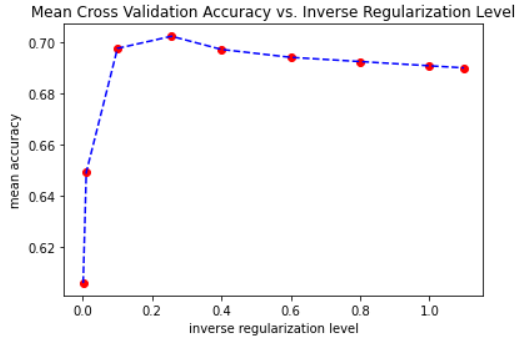
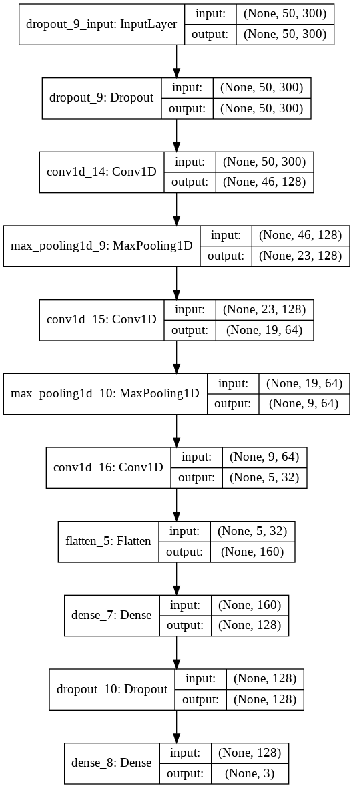
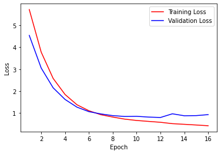
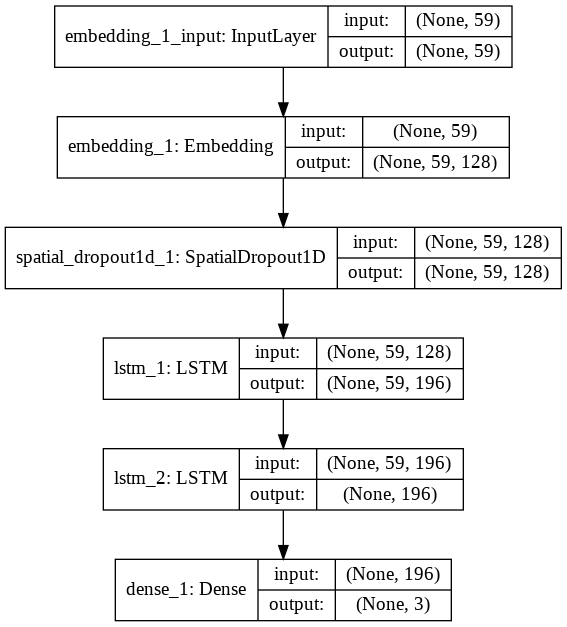
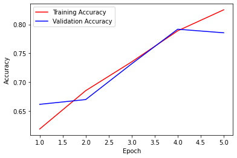
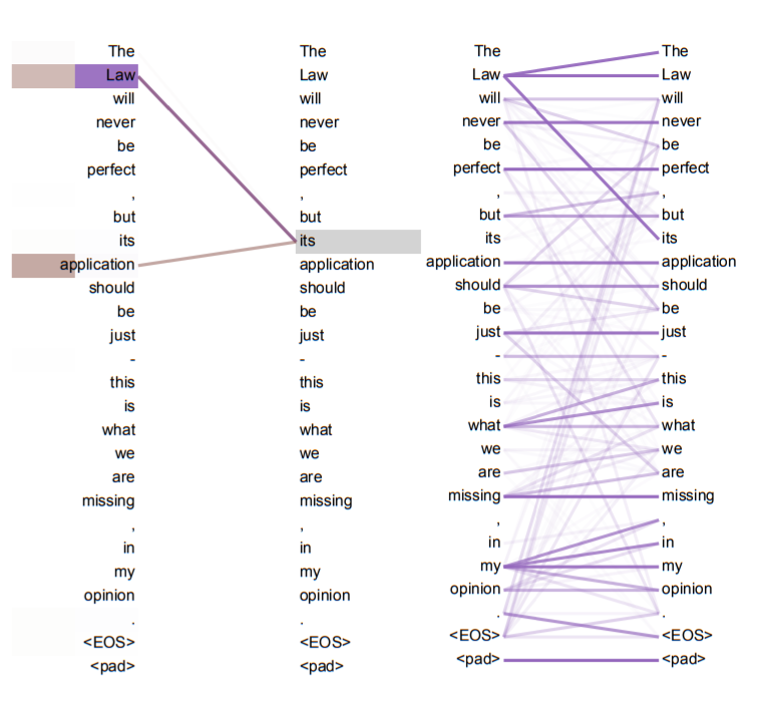

# Sentiment Analysis in Financial News
#### ML Modeling with Multinomial Logistic Regression, CNN, LSTM

### Introduction

Sentiment analysis is an application of Natural Language Processing in order to quantify subjective information; models extract information from opinion-based statements and determine the sentiment, or emotion, related to the statement. In particular, models usually identify and label positive, negative, and neutral sentiment from statements and documents.

Source: <a href="https://www.kdnuggets.com/2018/03/5-things-sentiment-analysis-classification.html">Symeon Symeonidis</a>

As with other news headlines, financial news headlines have the same sentiment as that of the information within the news itself. Furthermore, financial news headlines usually closely correlate with investor confidence. Thus, identifying the sentiments of these news headlines can aid predictions on market volatility, trading patterns, and stock prices. Improving the accuracy of models that conduct sentiment analysis on financial news headlines would have many further applications.

### Purpose
The purpose of this project is to build a model that will be able to accurately determine positive, neutral, or negative sentiment in financial news headlines. Our group applies a supervised learning model through multinomial logistic regression in order to achieve the goal. Furthermore, our group applies deep learning models, including convolutional neural networks (CNN) and long short term memory networks (LSTM), to conduct financial sentiment.

As an addendum, we tested the state of the art financial language model on our dataset to see the results and accuracy of a pre-trained model.

### Choosing our Models
We tested a conventional supervised learning model to see what the best accuracy would be for conducting sentiment analysis with models that were not specifically deep-learning models. We chose multinomial logistic regression due to the fewer weights needed to train for the model.

The remaining models were deep learning models. Convolutional neural networks are models that use convolutional layers, which slide a kernel onto the input data. CNNs have had applications in NLP, as word embeddings provide the possibility to use convolution layers to capture semantic information and relations between individual words. Through these convolution layers, partial context can be captured. Thus, we used CNNs as the partial context that could be captured likely would outperform the conventional supervised learning model we tested.

Source: <a href="https://towardsdatascience.com/a-comprehensive-guide-to-convolutional-neural-networks-the-eli5-way-3bd2b1164a53">Sumit Saha</a>

We also tested an LSTM model, which is a type of recurrent neural network (RNN). Recurrent neural networks are a type of neural network in which information is fed into the network sequentially. For text and NLP, the RNN creates a hidden state based on running the model on a word, and a new hidden state is generated through using the the previous hidden state and the new word to run the model on. LSTM models are a subtype of RNN models which improve upon the RNN by selectively choosing which information from previous states to remember and which information to forget. We used an LSTM model because LSTM models and RNNs are able to capture sequential information, and, under the assumption that text occurs sequentially, these models may best capture previous context information in order to correctly determine sentiment. 

Source: <a href="https://medium.com/deeplearningbrasilia/deep-learning-recurrent-neural-networks-f9482a24d010">Pedro Torres Perez</a>

### Dataset
For the financial news dataset, we used the following dataset from kaggle, https://www.kaggle.com/ankurzing/sentiment-analysis-for-financial-news. The dataset contains 4846 individual datapoints, each one divided between one of three labels - positive, negative, neutral - and the text of the dataset. Note that the length of the text is considerably shorter than that of other sentiment analysis datasets, which may have an effect with the results of our models.

Below are the first three entries of the dataset:
- `According to Gran , the company has no plans to move all production to Russia , although that is where the company is growing . `
- `Technopolis plans to develop in stages an area of no less than 100,000 square meters in order to host companies working in computer technologies and telecommunications , the statement said . ` 
- `The international electronic industry company Elcoteq has laid off tens of employees from its Tallinn facility ; contrary to earlier layoffs the company contracted the ranks of its office workers , the daily Postimees reported .`

Word cloud of the stemmed dataset

The graph below indicates the distribution of labels. Due to the unbalanced nature of the data, it is possible that the results of every model could be affected.

Distribution of labels

## Multinomial Logistic Regression

### Pre-processing

To preprocess our data, we first took care of stemming--removing word endings resulted from different tenses and word plurality.  Then we removed common stopwords from our news data set. Then we used a count vectorizer to vectorize the words in our dataset by their counts: Each news headline will be a row and each word in our vocabulary will be a column; the vocabulary is the set of words left after stemming and stopwords removal.

 Each row is a headline, each column is a word in our vocabulary, and each entry represent the count of the word in the news headline. 

#### Model

To create our model, we used 80 percent of our data to train on the logistic regression function provided by sklearn. We ran a 5-fold cross validation algorithm on our model trained with several different regularization level. We were able to achieve the best accuracy results of 70 percent with an inverse regularization value of 0.26.

 Showing how mean cross validation accuracy changes as inverse regularization in logistic regression changes 

### Results

### Discussion

## Convolutional Neural Network

### Pre-processing
For pre-processing the text of the dataset, we first removed the punctuation from the text in the dataset before lowercasing each token. Then, we removed the common English list of stopwords from our dataset from the nltk.corpus library. 

For the labels, each label of each data point is treated as a one-hot three-dimensional vector embedding, depending on the value of the label.

#### Word2vec
Afterwards, we used the common word to vector embedding, word2vec. Word2vec is a type of word-vector embedding developed by Google, which is trained on a dataset of Google News. The general word2vec algorithm takes a word and outuputs the probability of every word in the corpus to appear in the input word's surroundings. As a result, the algorithm allows for words in similar contexts to have word vectors with high cosine similarity, as the word vectors will have similar probabilities. As a result, word2vec is able to capture semantic meaning of words, and serve as a viable input to our CNN model.

We used the pre-trained word2vec model to pre-process our dataset. The word to vector embedding maps every word to a 300-dimensional vector. The maximum length of a sequence in our dataset is 47, so we set the maximum length of our input to be 50. For each word in a datapoint, if a mapping in word2vec existed, we mapped it and appended it to our input; if such a mapping did not exist, we randomized the entries in our input. Finally, each datapoint was padded with 0's to ensure that the maximum sequence length is 50. Thus, the size of the input for every datapoint is 50x300.

After pre-processing, the dataset becomes an input of Nx50x300, in which N is the number of datapoints of our dataset. We split the dataset into 80% training, 10% validation, 10% testing.

### Model
For our model, we used the Keras library with TensorFlow backend. As with our other models, it was written in a Jupyter notebook in Google Colab, which are all available on the github repository.

Our CNN model took inspiration from conventional CNN models used in other fields, such as computer vision. However, due to the maximum length of the word count being only 50, our model consisted of three 1-D convolutional layers rather than four 1-D convolutional layers. These layers have a the ReLU activation function and a kernel size of 5. The convolutions span through the entire sequence in order to capture as much contextual information as possible. In between the convolutional layers, there are maxpool layers with a pool size of 2. Finally, the data is passed as input to a flatten layer and a fully-connected layer that is 128 dimensions long, before finally being passed to the output layer which uses the softmax function to produce 3 softmaxed outputs, which represent the 3 labels of the dataset. Categorical cross entropy is used as our loss function. There are a total of 264,419 trainable parameters.

In order to improve the accuracy of the model, we altered the kernel size, maximum pool size, as well as added and removed CNN layers. We also implemented the Adam optimizer with a learning rate of 0.00025 as it converged faster and had better results than stochastic gradient descent. The model below proved to be the most effective in achieving consistently high accuracies.

Our CNN model

To reduce overfitting, dropout, regularization, and early stopping were added to the model. Dropout with a factor of 0.3 was added before the convolutional layers as it reduced overfitting the most, and another dropout layer was added between the fully-connected layers at the end of the model. L2 and bias regularizers were added to the fully-connected layers, and the accuracy of the model was highest with a factor of 0.04. Due to the short length of each data point, early stopping once validation loss does not decrease in 3 epochs was added.

### Results
Our evaluation metric was the accuracy of our sentiment prediction. For the test set, we compared the number of correctly classified financial news headlines with the total number of the test set. Though we did not initially set a target accuracy to achieve, after seeing the accuracy of our multinomial logistic regression model, we hoped to achieve an accuracy over 66%. In the end, we were able to achieve an accuracy of <b>70.103091%</b>.

Below are visualizations that plot the loss and the accuracy versus epochs during the training of the model.

### Discussion
We speculate that there are several reasons why we achieved such an accuracy and how we could improve our model. First of all, as mentioned in the discussion of the dataset, the imbalance of the number of labels could skew our results and model. Furthermore, the financial corpus and dataset is different than that of the general corpus of text. Thus, since we used the pre-trained Google word2vec vector embedding, we likely conducted an incorrect mapping of the words to a vector space which was not sufficient for capturing semantic relationships between words in the financial dataset. To improve our model, a word embedding with a model that is pre-trained on the financial dataset, such as FinBERT word embeddings, could likely improve our results.

## Long Short Term Memory

### Pre-processing
We used the text to sequences method of the keras library to pre-process the dataset. The texts to sequences method converts the text into a sequence of integers, and only the words that are known by the tokenizer is taken into account. 

For the labels, each label of each data point is treated as a one-hot three-dimensional vector embedding, depending on the value of the label.

### Model
As mentioned earlier, the LSTM model is a type of Recurrent Neural Network, in which each hidden state is taken as additional input to calculate the next hidden state. The LSTM model improves upon the RNN because, as hidden states continue, RNNs tend to forget the information gained from hidden states that occured very early on in the sequence; this is known as catastrophic forgetting. Thus, the LSTM improves upon the issue by selectively choosing which information to keep and which information to forget.

Our model consists of an embedding layer to convert the text input into an embedding, two LSTM layers, and a dense, fully-connected layer that outputs the softmaxed outputs of the probability of the three label predictions of each datapoint. The embedding dimension of the input is 128 dimensions, and the LSTM dimension is 196 dimensions long. We use categorical cross entropy as our loss function, and we used the Adam optimizer as it provided better results than that of stochastic gradient descent. Overall, there were 819,503 trainable parameters in the model. The following model below proved to be the most effective in in achieving high accuracies.

In order to prevent overfitting, a spatial dropout layer was added before the LSTM layers. The spatial dropout layer was found to be the best at a factor of 0.4. Furthermore, recurrent dropout and dropout was added to the LSTM layers. Due to the fact that our model had two LSTM layers, the dropout of each LSTM layer was the best at a factor around 0.4, and the recurrent dropout was found to be best around a factor of 0.5. Early stopping was not added to this model since it only required a few epochs to train and generalize well.

### Results
As with our other models, our evaluation metric was the accuracy of our sentiment prediction. We tried to see if we could improve upon the accuracy seen by our CNN model. 
In the end, we were able to achieve a test accuracy of <b>73.814434%</b>.
  
Below are the visualizations that plot the loss and the accuracy versus epochs during the training of the model.

### Discussion
The LSTM model consistently had above a 72% accuracy, indicating the effectiveness of Recurrent Neural Networks in improving upon NLP tasks due to its natural recurrent and sequential nature. However, we speculate that the LSTM model may not be extremely effective in this dataset due to the fact that the lengths of the headlines are much short, at a maximum sequence length of only 47. Thus, the LSTM may have a negligible effect on improving the dataset compared to solely using Recurrent Neural Networks.

## Comparing our models

The CNN model drastically improved upon the results of the logistic regression, as we were able to achieve above a 70% accuracy for our model. The model converged fast and trained fast, requiring only about 12 epochs on average to train. The model generalized well, and the convolutions over the word embeddings of our model proved to be able to capture contextual and semantic information that aided in predicting the sentiment of each data point.

Finally, the increase of the LSTM model is not negligible, as we were able to achieve almost a 74% accuracy for our model. Fewer epochs were required to train our LSTM model, but it is worth noting that, due to the temporal nature of RNNs, each epoch took a considerable amount of time longer to train than an individual epoch for the CNN model. The recurrent nature of our LSTM model proved to be more effective in predicting the sentiment of each data point, likely due to the fact that text is sequential and LSTM and RNN models take advantage of the sequential nature of data. In the end, our LSTM model proved to be the best model with the highest accuracy out of all three of our models.

## Addendum: State-of-the-art FinBERT model
In the past few years, a new neural network architecture was created and has had significant improvements to NLP tasks. The transformer, which uses multihead self-attention to capture information about relationships between features in a sequence, has proven to be extremely effective in capturing contextual information of a sequence, much more so than any other architecture. Furthermore, the introduction of BERT, a type of transformer architecture, has led to improvements in transfer learning and pre-training the model on a corpus of data before finetuning the weights on downstream tasks. Our goal was to load in the pre-trained weights of a transformer model and test the results of the pre-trained model on our entire dataset.

### Model
The transformer is a neural network architecture that solely uses attention to capture contextual information between different words in a sequence. The general idea of attention is that the network uses only the most relevant information in some concentrated part of the sequence, rather than using the entire sequence itself to produce an output. Furthermore, self-attention is a type of attention the computes an internal representation of a sequence by relating different positions and words of that sequence to other positions and words. As such, self-attention is extremely effective in capturing contextual and semantic relationships between words.

Self attention of the sequence being able to capture relationships such as pronoun antecedent relationships

Source: <a href="https://arxiv.org/pdf/1706.03762.pdf">Vaswani et al.</a>

BERT is a transformer architecture that captures bi-directional relationships in text. The conventional way of thinking of text is that it occurs in one direction; a word appears after another word, and thus relationships between such words occur in one direction. The major breakthrough of BERT is the bi-directionality of the model, as text can have contextual relationships in both directions. As such, BERT is a state of the art model with major improvements in almost all NLP tasks.

Source: <a href="https://towardsdatascience.com/bert-explained-state-of-the-art-language-model-for-nlp-f8b21a9b6270">Rani Horev</a>

FinBERT is model of BERT that is further pre-trained on the financial corpus of text, therefore being specifically tuned torwards NLP tasks in the financial domain. We loaded a pre-trained version of FinBERT from the transformer library. We did not finetune the model because the loaded FinBERT model was already tuned to perform sentiment analysis.

### Results
The r

### Discussion

## References
